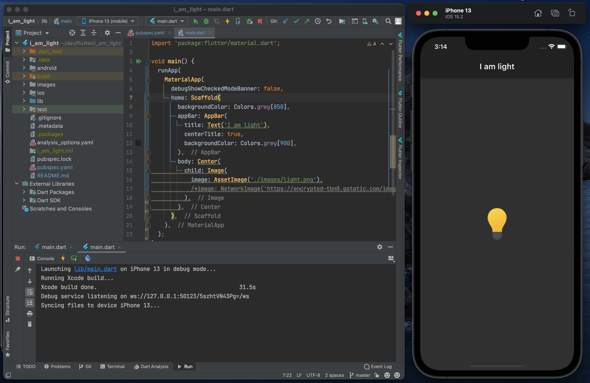

# i_am_light

I am light app - (supposed to be i am poor app challenge) my second flutter app, from the Complete Flutter Development Bootcamp by Angela Yu.

## Project screenshot

## Image resources
- Light icon from [Icons8](https://icons8.com/icon/QfpWr2gFM07s/light)

## Flutter resources and doc

- [Lab: Write your first Flutter app](https://flutter.dev/docs/get-started/codelab)
- [Cookbook: Useful Flutter samples](https://flutter.dev/docs/cookbook)

For help getting started with Flutter, view our
[online documentation](https://flutter.dev/docs), which offers tutorials,
samples, guidance on mobile development, and a full API reference.
